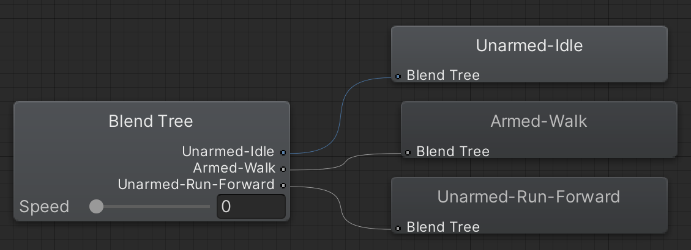

# Unity Clean Architecture RPG

- [專案簡介](#專案簡介)
- [系統架構](#系統架構)
- [功能細節](#功能細節)
    - [角色(資料編輯、位置佈署、動作控制、攻擊判定)](#角色)
    - [支援物件(EventBus、ObjectPool)](#支援物件)
- [素材來源](#素材來源)

## 專案簡介

一個以Unity套用整潔架構來開發的動作RPG，內容為一個可供探索的地城並以擊敗Boss作為遊戲的結束，包含以下功能:
- 動作: 移動、奔跑、攻擊、翻滾、施放技能、使用道具、撿取物品
- 背包: 儲存武器、魔法、道具等物品並提供裝備、卸除、丟棄等功能
- 敵人: 會在特定路徑上巡邏，當玩家進入偵測範圍時開始追逐與攻擊
- 能力值:
    - 血量: 降低至0會死亡，玩家的情況會在起點復活；敵人則會消失並留下掉落物
    - 韌性: 降低至0會產生受擊反應並將數值重設
    - 魔力: 使用技能時需要的資源

※執行檔案在Build資料夾內，支援鼠鍵與手把兩種輸入

※因為有使用付費素材所以Assets/Elements資料夾內檔案並無上傳，專案內部分檔案設定會有遺失

https://user-images.githubusercontent.com/88575300/163971345-349e1a14-c533-414b-91a9-27a036afc60b.mp4

https://user-images.githubusercontent.com/88575300/163971488-6577b7dc-7240-45cd-8905-ef4487acd7be.mp4

https://user-images.githubusercontent.com/88575300/163971593-101b0d72-3086-4990-b961-27eff46e8700.mp4

https://user-images.githubusercontent.com/88575300/163971673-a029f521-705c-4859-a437-0555842d662b.mp4

操作說明: 

|功能|鼠鍵|手把|備註|
|-|-|-|-|
|移動|WASD|左類比|
|奔跑|Shift|LB|長壓|
|翻滾|Space|A|
|攻擊|滑鼠左鍵|X|
|施放技能|滑鼠右鍵|Y|需裝備Magic|
|撿取物品|F|B|
|使用道具|C|RB|
|切換道具快捷欄|滑鼠滾輪|LT/RT|
|開關背包|E|Start|
|關閉背包物品選單|Backspace|A|
|開關遊戲選單|ESC|Back|
|UI移動|↑↓←→|十字鍵|
|UI確定|Enter|B|

## 系統架構


遊戲的設計會先分析成複數個問題(Domain)，例如因為需要控制角色的動作而產生ActorDomain、計算角色的數值產生StatDoamin、物品的儲存與使用產生InventoryDomain。

一個Domain會包含完整的Entity、UseCase、Interface Adapter這三層的設計，Domain之間的溝通會有對應的EventHandler處理，最後由Component(繼承MonoBehaviour的物件)將結果反應到畫面上。

以攻擊判定與傷害處理為例:
1. WeaponHitter(產生武器Hitbox的Component)偵測到敵人
2. 呼叫EventBus送出HitboxTriggered(封裝攻擊者、擊中對象資料的物件)事件
3. HitboxTriggeredHandler收到事件開始處理:
    1. 從ActorController取得擊中對象目前的動作狀態，如果是迴避那就不處理後續的傷害
    2. 從ActorController取得攻擊者目前的裝備
    3. 從ItemConfigOverView(編輯物品列表的ScriptableObject)取得裝備的傷害
    4. 調用StatController的ModifyStatValue方法將擊中對象的血量扣除裝備的傷害
4. ModifyStatValueUseCase處理完數值計算呼叫IEventPublisher送出StatValueModified事件
5. StatValueModifiedHandler呼叫StatPresenter的OnStatValueModified方法
6. StatPresenter修改IStatUI的Value屬性使ValueBar(實作IStatUI用來控制Unity UI組件的Component)將新的血量更新在畫面上

另外，實作上還會存在一個GameSystemInitializer，負責所有Domain、EventHandler的依賴注入、事件註冊這類系統初始化工作。

## 功能細節

### 角色

- 資料編輯

    
    
    以ScriptableObject製作簡易的編輯器，以Id作為辨識來綁定建立時需要的Prefab、初始武器、所需要的能力值與對應的UI。

- 位置佈署

    
    

    ActorSpawner可以設定要配置的角色的Id，在執行時透過EventBus傳送事件給ActorController來建立角色。而ActorPatrolPath則是在ActorSpawner的基礎上增加編輯AI巡邏路線的功能。

- 動作控制

    
    
    首先是控制的輸入，玩家側使用Unity新式的InputSystem，PlayerInput組件在有輸入操作時會引發C# Event，藉此取得輸入；敵人側則是用State Pattern設計一個簡易的AI來控制。

    
    

    取得輸入後會發送事件通知ActorController調用對應的UseCase來更新Actor(Entity)的資料，比如現在角色處於Locomotion狀態那就能更新動作，反之為了避免Animator的Trigger連續觸發就會保持不變，或者要更新的狀態是受擊或死亡那就會強制轉換動作等等，處理完再次發送事件通知ActorPresenter調用MotionPerformer組件來操作Animator跟CharacterController完成角色的動畫控制與移動。

- 攻擊判定

    

    武器或技能生成的投擲物上掛有HitboxSetter組件可調整Hitbox(圖中綠色方塊部分)作為偵測範圍的依據，再來是判定啟動的觸發，武器方面角色上掛有WeaponHitter組件，會接收攻擊動畫的動畫事件並傳入結束偵測的normalizedTime；投擲物則是一產生就開始偵測直到撞上其他物件。

    

    偵測的作法是紀錄Hitbox六個面的中心點，從第二次更新開始能形成六道Raycast，這樣連續的更新就能形成一個完整的軌跡，一旦有擊中對應Layer的GameObject就會發送事件做傷害處理。這個做法會有可能略過Collider太小的目標的缺點，但花費會比BoxCast小，可評估精度、花費的需求來做選擇。

### 支援物件

- EventBus

    提供註冊與發送事件的功能，原本ClassA調用ClassB的情況可以做些調整，改為將ClassB的某方法註冊在某事件上，ClassA通過發送該事件間接調用ClassB註冊的方法，兩者的依賴關係會變成雙方皆依賴EventBus，這樣的好處在於Domain之間或Domain與View之間可以不須要任何依賴關係就能進行系統間的溝通。

    ```
    public class EventBus : IEventPublisher
    {
        private Dictionary<Type, List<Action<object>>> _callbackListsByType = new Dictionary<Type, List<Action<object>>>();

        public void Register<T>(Action<T> callback)
        {
            Type type = typeof(T);
            if (!_callbackListsByType.ContainsKey(type))
            {
                _callbackListsByType[type] = new List<Action<object>>();
            }
            _callbackListsByType[type].Add(signal => callback((T)signal));
        }

        public void Post(object signal)
        {
            Type type = signal.GetType();
            if (!_callbackListsByType.ContainsKey(type))
            {
                return;
            }
            foreach (var callback in _callbackListsByType[type])
            {
                callback(signal);
            }
        }

        public void PostAll(List<object> signals)
        {
            List<object> signalsCopy = new List<object>(signals);
            signals.Clear();
            foreach (var signal in signalsCopy)
            {
                Post(signal);
            }
        }
    }
    ```

- ObjectPool

    物件池產生的實體在職責結束後會返回池內等待下次調用，以重複利用的方式來避免需要產生新的實例。需要大量使用的物件能利用此特性解決執行時因為GameObject.Instantiate造成的性能問題，也能將物件產生的職責交由物件池負責，客戶端只需要調用即可。

    以這個專案來講AudioManager就是個例子，當有音效事件觸發時AudioManager就會需要產生一個AudioSource到指定位置進行撥放，遊戲中複數角色的腳步聲或者UI的操作就會產生大量需求。這時設計一個SoundEmitter(繼承RecyclableObject的Class)並提供設定AudioSource的方法就能套用物件池來滿足需求。

    ```
    public class ObjectPool<T> where T : RecyclableObject
    {
        private Queue<T> _clones = new Queue<T>();
        private T _original;
        private Transform _cloneParent;

        public ObjectPool(T original, Transform cloneParent, int initialCount)
        {
            _original = original;
            _cloneParent = cloneParent;
            for (int i = 0; i < initialCount; i++)
            {
                CloneToContainer();
            }
        }

        public T GetObject()
        {
            if (_clones.Count == 0)
            {
                CloneToContainer();
            }
            T result = _clones.Dequeue();
            return result;
        }

        private void CloneToContainer()
        {
            T clone = GameObject.Instantiate(_original, _cloneParent);
            clone.Sleeped += recyclableObject => _clones.Enqueue(recyclableObject as T);
            _clones.Enqueue(clone);
        }
    }
    ```

    ```
    public abstract class RecyclableObject : MonoBehaviour
    {
        public event Action<RecyclableObject> Sleeped;

        protected virtual void Sleep()
        {
            Sleeped?.Invoke(this);
        }
    }
    ```

## 素材來源

[RPG Character Mecanim Animation Pack](https://assetstore.unity.com/packages/3d/animations/rpg-character-mecanim-animation-pack-63772)

[Action RPG FX](https://assetstore.unity.com/packages/vfx/particles/action-rpg-fx-38222)

[Toon Projectiles 2](https://assetstore.unity.com/packages/vfx/particles/spells/toon-projectiles-2-184946)

[Support package for Hovl Studio assets](https://assetstore.unity.com/packages/tools/utilities/support-package-for-hovl-studio-assets-157764)

[Footsteps - Essentials](https://assetstore.unity.com/packages/audio/sound-fx/foley/footsteps-essentials-189879)

[Fantasy Sounds Bundle](https://assetstore.unity.com/packages/audio/sound-fx/fantasy-sounds-bundle-193760)

[Knife free icon created by Freepik - Flaticon](https://www.flaticon.com/free-icon/knife_5056409)

[Spear free icon created by Freepik - Flaticon](https://www.flaticon.com/free-icon/spear_1218801)

[Sword free icon created by Freepik - Flaticon](https://www.flaticon.com/free-icon/sword_874337)

[Media Fire free icon created by Freepik - Flaticon](https://www.flaticon.com/free-icon/media-fire_873183)

[Fire free icon created by Freepik - Flaticon](https://www.flaticon.com/premium-icon/fire_1840472)

[Potion free icon created by Freepik - Flaticon](https://www.flaticon.com/free-icon/potion_750846)

[Magic Potion free icon created by Freepik - Flaticon](https://www.flaticon.com/premium-icon/magic-potion_2778323)
